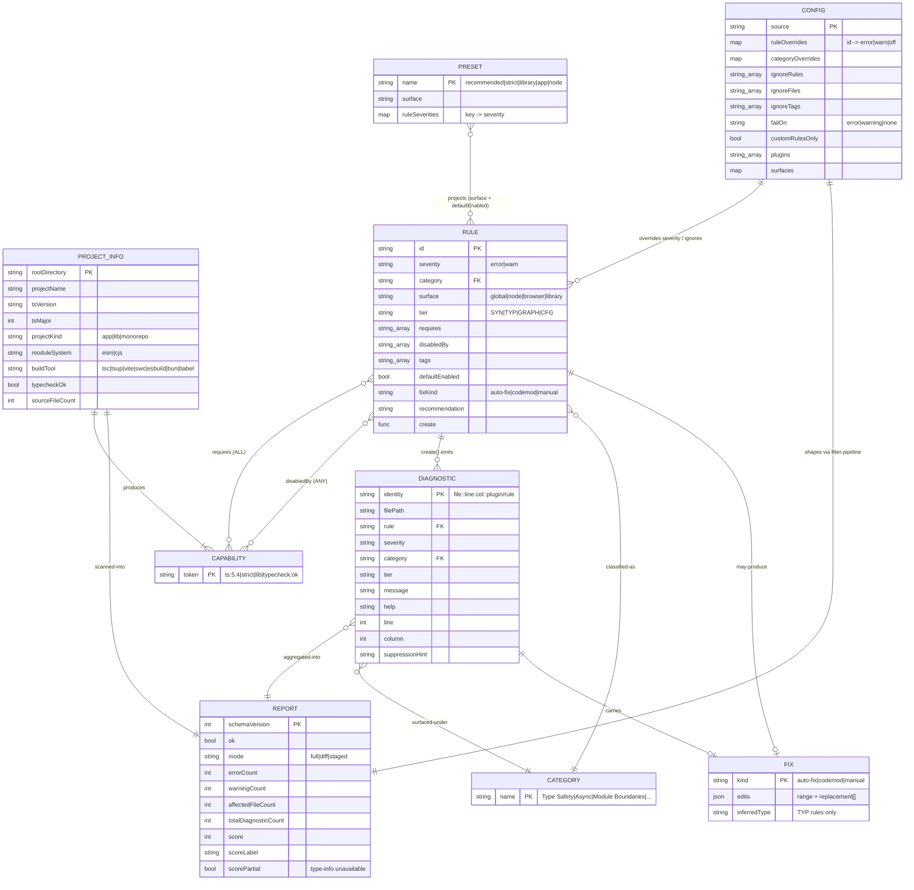

# AI-Native Specification — `tsnuke`

*Phase A output of `/modernize-reimagine react-doctor "equivalent tool but for TypeScript, like react-doctor is for React projects"`. Generated 2026-05-24.*

> **Implementation note (added after the rewrite).** This is the **specification**; it remains the authority for *what* the tool must do — the 20 capabilities, the domain model, and the **BC-01…BC-24 behavior contract are current and binding**. The shipped implementation is an **Effect-TS v3.21 strangler-fig rewrite** across **32 `@tsnuke/<dir>-effect` packages** (see root `CLAUDE.md` §2; build/wire details in `ARCHITECTURE.md`). Two concrete claims in this file have been overtaken by the implementation: (1) §2.3's "~45–62 initial rules" estimate is now **88 rules** across 13 categories; (2) §6's Phase-B "build the seam, stub Tier-2" decision is **superseded** — all four tiers are live, including the 18 type-aware TYP rules. Where this file says "zod or hand-rolled validator", the implementation uses `effect/Schema`.

> **This is a rebuild from extracted intent, not a port.** `react-doctor` is the **specification source** — the proven *mechanisms* (scoring, the diagnostic filter pipeline, capability-gated rule activation, the security trust boundaries, the distribution surfaces). The React **domain** (286 React/JSX/RN rules, framework+version gating, a mandatory remote score round-trip) is replaced by a **TypeScript** domain designed AI-native for 2026.
>
> Spec mined from: `BUSINESS_RULES.md` (73 Given/When/Then rules), `DATA_OBJECTS.md` (entity model), `ASSESSMENT.md` (8 domains), plus three parallel reimagine passes (interface catalog · engine-mechanism classification · TS rule-catalog design).

---

## 0. The one finding that shapes everything

`react-doctor`'s engine is **oxlint** — a *type-unaware* AST linter. That was sufficient for React, where almost every signal (rules-of-hooks, JSX prop freshness, component naming, a11y) is **syntactic**. It is **not** sufficient for a TypeScript doctor. The highest-value TypeScript health signals — floating promises, `any` propagation through assignment/call chains, non-exhaustive unions, unnecessary conditions on non-nullable types, misused `await` — are visible **only** through the TypeScript TypeChecker (`ts.Program`).

The May-2026 ecosystem has already split along this exact seam: oxlint/Biome ship fast **syntactic** rules in Rust; **typescript-eslint** owns the canonical **type-aware** set; `tsgolint`/`tsgo` is preview-stage. **A naive port of react-doctor's single-tier oxlint architecture would silently drop the most valuable third of the TypeScript catalog.**

→ **Architectural consequence:** `tsnuke` runs a **two-tier engine** — Tier 1 syntactic (fast, always available) + Tier 2 type-aware (gated on the project actually type-checking) — and computes its score **locally and deterministically** (no mandatory network round-trip). These two divergences from react-doctor are the heart of the reimagine; everything else is carried-over mechanism.

---

## 1. Capabilities (what the system must do)

Derived from the union of legacy business rules and external interfaces. Each capability carries a **provenance** (`carry` = proven mechanism kept; `adapt` = mechanism kept, domain swapped; `new` = AI-native addition with no legacy analog) and a **proposed priority** (P0/P1/P2 — *to be confirmed at the Phase B checkpoint, §6*).

| # | Capability | Provenance | Priority | Source rules / interfaces |
|---|---|---|---|---|
| C1 | **Discover a TypeScript project** — locate `tsconfig.json` (resolve `extends`), read `package.json`, classify project kind (app/lib/monorepo), detect TS version, module system, build tool; refuse non-TS projects | adapt | **P0** | RULE-018/019/020/021/022; ProjectInfo |
| C2 | **Compute a capability token set** from project facts (TS version, tsconfig strict flags, module system, project kind, build tool, **`typecheck:ok`**) | adapt | **P0** | RULE-023 |
| C3 | **Activate rules** via the `requires`(AND) / `disabledBy`(ANY) / `ignore.tags` predicate over the token set — including the **inverted** pattern (a "turn this flag ON" rule self-disables when the flag is present) | carry | **P0** | RULE-024, RULE-032 |
| C4 | **Run a two-tier analysis engine** — Tier-1 syntactic pass (always) + Tier-2 type-aware pass (only when `typecheck:ok`), batched, with binary-split recovery on resource ceilings | adapt+new | **P0** | RULE-014/049/055; §0 |
| C5 | **Emit `Diagnostic`s with deterministic identity** (`filePath::line:column::plugin/rule`) + a `tier` tag (SYN/TYP/GRAPH/CFG) | carry+new | **P0** | DATA_OBJECTS §1 |
| C6 | **Run the diagnostic filter pipeline** — ordered precedence: auto-suppress → severity override → ignore (rules/files/overrides) → inline-disable directives | carry | **P0** | RULE-056/057/058/059/060 |
| C7 | **Compute a 0–100 health score locally & deterministically** — per-distinct-rule penalty (errors ×1.5, warnings ×0.75), floored at 0; **no network required** | adapt+new | **P0** | RULE-001/002/067/069; §0 |
| C8 | **Mark the score partial / not-comparable when type info is unavailable** (Tier-2 skipped) | new | **P0** | §0 fail-safe; RULE-063 |
| C9 | **Build a versioned JSON report** (`schemaVersion`, summary, per-project entries, worst-project min for monorepos) | carry | **P0** | RULE-005/006/068; JsonReportV1 |
| C10 | **CLI** — `inspect` (default) with diff/staged/full modes, `--json`, `--score`, `--fail-on` exit-code gate, GH annotations, PR-comment mode; `install` for skill + git hooks | adapt | **P0** | RULE-040/041/042/043/044/045/062/064/065 |
| C11 | **Lenient config loading** — `tsnuke.config.json` / `package.json#tsNuke`; invalid fields dropped with a warning, never fatal; boundary-stopped ancestor walk | carry | **P1** | RULE-026/027/028/029/030 |
| C12 | **Programmatic API** — `diagnose(dir, opts) → { diagnostics, score, project, skippedChecks, elapsedMs }` | adapt | **P1** | `diagnose()` interface |
| C13 | **Machine-applicable fixes** — each rule declares `fixKind` (`auto-fix`/`codemod`/`manual`); fixes emitted as structured range+replacement edits; type-aware rules ship the inferred type | new | **P0** ⬆ | §0; AI-native |
| C14 | **Agent-tuned output** — rule-deduplicated, tier+fixKind sorted, category-grouped, path-stripped, token-efficient | new | **P0** ⬆ | AI-native |
| C15 | **ESLint flat-config adapter** — `meta`/`rules`/`configs` (presets: `recommended`/`strict`/`library`/`app`/`node`) | adapt | **deferred** | eslint adapter interface |
| C16 | **Security trust boundaries** — git ref-name guard, Zip-Slip defense on staged files, glob ReDoS caps, sanitized subprocess env, **hardened plugin trust model** (no auto-`require` of scanned-repo plugins) | carry+fix | **P0** | RULE-031/033/034/035/037/038 |
| C17 | **GitHub Action** — composite action wrapping the CLI (inputs: directory/diff/fail-on/annotations/token; output: `score`); **pinned version**, read-only token on forks | adapt+fix | **deferred** | action.yml |
| C18 | **Agent skill + native agent hooks** — `SKILL.md` trigger spec + command recipe; non-blocking hooks for Claude Code / Cursor | adapt | **P1** | SKILL.md |
| C19 | **Optional remote score / leaderboard / share** — local score is canonical; remote endpoint is opt-in telemetry only, with the proven request caps (2 MB / 25 MB decompressed / 50k count / per-item shape) | adapt | **DROPPED (v1)** | RULE-039; /api/score |
| C20 | **Codegen-verified rule registry** — directory = category, file = rule; `gen:check` fails on missing metadata or unknown bucket | carry | **P1** | rule registry mechanism |

---

## 2. Domain Model

### 2.1 Entities

| Entity | Role | Legacy analog |
|---|---|---|
| **Rule** | A diagnostic definition: `id`, `severity`, `category`, `surface` (global/node/browser/library), `tier` (SYN/TYP/GRAPH/CFG), `requires[]`, `disabledBy[]`, `tags[]`, `defaultEnabled`, `fixKind`, `recommendation`, `create()` | `Rule` (rule.ts) |
| **Capability** | A single token in the project's `Set<string>` (e.g. `ts:5.4`, `strict`, `lib`, `typecheck:ok`) | capability token |
| **ProjectInfo** | Discovered facts that *produce* the capability set: `tsVersion`, `tsMajor`, `projectKind`, `moduleSystem`, `buildTool`, strict-flag map, `typecheckOk`, `sourceFileCount` | `ProjectInfo` |
| **Config** | User config: rule/category severity overrides, ignore lists (rules/files/overrides/tags), surfaces, `failOn`, plugins | `ReactDoctorConfig` |
| **Preset** | A read-only projection of Rules by surface + `defaultEnabled` → key→severity map | preset (rules.ts) |
| **Diagnostic** | One finding: identity, `filePath`, `plugin`, `rule`, `severity`, `message`, `help`, `line`, `column`, `category`, `tier`, `fix?`, `suppressionHint?` | `Diagnostic` |
| **Fix** | Structured remediation: `kind`, `edits: {range, replacement}[]`, optional `inferredType` | *new* |
| **Report** | Versioned run aggregate: summary (counts + score + label + `scorePartial`), per-project entries, diff info, mode, timing | `JsonReportV1` |

### 2.2 erDiagram



### 2.3 Rule-catalog taxonomy (13 categories ← 19 React buckets)

| # | tsnuke category | Analogous react-doctor bucket | Dominant tier |
|---|---|---|---|
| 1 | Type Safety (`any`/`unknown` discipline, unsafe value flow) | state-and-effects (core correctness) | **TYP** |
| 2 | Type Assertions & Escapes (`as`, `!`, `@ts-ignore`) | react-builtins escape hatches | SYN |
| 3 | Module Boundaries & Architecture (cycles, layering, public API) | architecture | SYN + GRAPH |
| 4 | Generics & Type-Level Complexity | component complexity | TYP |
| 5 | Async / Promises (floating/misused) | state-and-effects (async) | **TYP** |
| 6 | Exhaustiveness & Narrowing | conditional rendering | **TYP** |
| 7 | Error Handling (catch typing, throw discipline) | error boundaries | Mixed |
| 8 | Dead Code & Unused Exports | dead-code pass | SYN + GRAPH |
| 9 | Compiler Strictness Gaps (tsconfig flags OFF) | capability/version gating (inverted) | **CFG** |
| 10 | Declaration & API Hygiene (`.d.ts`, public surface) | display-name / public conventions | TYP (lib) |
| 11 | Type Performance (instantiation depth, return annotations) | performance | TYP |
| 12 | Naming & Idioms (`interface` vs `type`, enum vs union) | naming conventions / design | SYN |
| 13 | Security (secrets, `eval`, `any`→sink flow) | security | Mixed |

Buckets that vanish (React-only): Design, A11y, JSX, React-Native, framework-builtins, Tailwind. Categories that grow: the type-semantic ones (1, 4, 5, 6, 11) — exactly where Tier-2 earns its keep. Initial estimate was **~45–62 rules**; the **shipped catalog is 88 rules** (64 SYN / 18 TYP / 2 GRAPH / 4 CFG), aggregated in `rules-registry-effect`'s `registry.ts`; representative P0 rules are pinned in §5.

---

## 3. Interface Contracts

### 3.1 CLI (inbound) — `tsnuke [directory]`

Carry react-doctor's flag/mode/exit-code surface verbatim; rename product; swap React-specific framing.

```
tsnuke [directory]              # default = inspect; directory default "."
  --lint / --no-lint
  --dead-code / --no-dead-code     # GRAPH tier; default on
  --deep / --no-deep               # NEW: force/skip Tier-2 type-aware pass
  --verbose
  --score                          # print only the score (quiet)
  --json [--json-compact]          # emit a single JsonReportV1
  --fix                            # NEW: apply auto-fix edits in place
  -y, --yes | --full | --project <name,...>
  --diff [base] | --staged         # mutually exclusive
  --fail-on <error|warning|none>   # default error; sets exit 1
  --annotations | --pr-comment     # mutually exclusive with --json/--score
  --explain <file:line> | --why <file:line>   # AI-native: natural-language "why"
  --respect-inline-disables / --no-respect-inline-disables
  --no-score
tsnuke install [--yes --dry-run --agent-hooks --cwd <dir>]
```

**Exit codes:** `0` success / gate not tripped · `1` gate tripped (per `--fail-on`, on the `ciFailure` surface; suppressed under `--score`) or uncaught error (JSON mode writes `{ok:false,error}` then exit 1) · `0` on EPIPE · `130` on SIGINT/SIGTERM. **Mutually-exclusive mode rules** carried from RULE-042.

### 3.2 Programmatic API (inbound)

```ts
diagnose(directory: string, options?: DiagnoseOptions): Promise<DiagnoseResult>

interface DiagnoseOptions {
  lint?: boolean
  deadCode?: boolean
  deep?: boolean            // run Tier-2 type-aware pass (default: auto if typecheck:ok)
  verbose?: boolean
  includePaths?: string[]   // diff/staged narrowing
  respectInlineDisables?: boolean
}
interface DiagnoseResult {
  diagnostics: Diagnostic[]
  score: ScoreResult | null
  scorePartial: boolean     // NEW: true when Tier-2 was skipped
  skippedChecks: string[]
  skippedCheckReasons?: Record<string, string>
  project: ProjectInfo
  elapsedMilliseconds: number
}
```

Tagged errors: `TsNukeError`, `ProjectNotFoundError`, `NoTypeScriptProjectError` (replaces `NoReactDependencyError`), `TsconfigNotFoundError`, `AmbiguousProjectError`.

### 3.3 JSON report (outbound) — `JsonReportV1`

Carry the versioned single-arm union design **as-is**; add `tier` to `Diagnostic` and `scorePartial` to summary.

```jsonc
{
  "schemaVersion": 1,
  "version": "string",
  "ok": true,
  "directory": "string",
  "mode": "full | diff | staged",
  "diff": { "baseBranch": "string", "currentBranch": "string|null",
            "changedFileCount": 0, "isCurrentChanges": false } /* | null */,
  "projects": [ { "directory": "string", "project": {}, "diagnostics": [],
                  "score": null, "scorePartial": false, "skippedChecks": [],
                  "skippedCheckReasons": {}, "elapsedMilliseconds": 0 } ],
  "diagnostics": [ {
    "filePath": "string", "plugin": "tsnuke", "rule": "string",
    "severity": "error | warning", "message": "string", "help": "string",
    "url": "string?", "line": 0, "column": 0, "category": "string",
    "tier": "SYN | TYP | GRAPH | CFG",
    "fix": { "kind": "auto-fix|codemod|manual", "edits": [], "inferredType": "string?" } /* optional */,
    "suppressionHint": "string?"
  } ],
  "summary": { "errorCount": 0, "warningCount": 0, "affectedFileCount": 0,
               "totalDiagnosticCount": 0, "score": null, "scoreLabel": null,
               "scorePartial": false },
  "elapsedMilliseconds": 0,
  "error": null
}
```

### 3.4 Local score (replaces the mandatory remote round-trip)

```
computeScore(diagnostics: DiagnosticInput[]): { score: number, label: string }
  empty            -> 100
  errorRules       = distinct "plugin/rule" with severity "error"
  warningRules     = distinct "plugin/rule" with severity "warning"
  penalty          = errorRules.size * 1.5 + warningRules.size * 0.75
  score            = max(0, round(100 - penalty))
  label            = score>=75 "Great" : score>=50 "Needs work" : "Critical"
```

Computed **client-side, in-process, deterministically.** No network. (react-doctor's RULE-001 math, RULE-003 bands — moved local.)

### 3.5 Optional remote score (outbound, opt-in telemetry) — `POST /api/score`

Kept only for leaderboard/share; **never required** for a score. Proven guards retained verbatim:

```yaml
# AsyncAPI-style fragment
POST /api/score:
  request:
    headers: { Content-Type: application/json, Content-Encoding: gzip? }
    caps: { contentLength<=2_000_000 (413), decompressed<=25_000_000 (413),
            diagnostics.length<=50_000 (413) }
    body: { diagnostics: DiagnosticInput[], repo?, sha?, tsVersion?, strict?,
            moduleKind?, projectKind?, sourceFileCount?, defaultBranch? }
    DiagnosticInput: { plugin, rule, severity:"error|warning", message, help,
                       line:number, column:number, category }   # filePath stripped
  response: { score: number, label: string }
  cors: "*"   auth: none
```

Metadata changes from react-doctor: drop `framework`/`reactVersion`; add `tsVersion`/`strict`/`moduleKind`/`projectKind`.

### 3.6 Subprocess contracts (outbound) — carry hardening verbatim

- **Type-aware engine:** in-process `ts.Program` (no subprocess) OR `tsgo`/`tsgolint` subprocess under the **same harness** as oxlint: array-arg `spawn`, no shell, sanitized env (drop `NODE_OPTIONS`/`NODE_DEBUG`/`npm_config_*`), batched (≤N files, arg-length cap), binary-split recovery, time/output ceilings → `EngineBatchExceeded{kind}`.
- **git:** array-arg `ChildProcess`, no shell, read-only subcommands; `isSafeGitRevision` ref-name guard on `--diff <base>` (reject empty / leading `-` / `.`-bounded / `..` / `@{` / out-of-charset). **Carry the whole service as-is.**

### 3.7 ESLint adapter / GitHub Action / Agent skill / Share routes

- **ESLint flat-config plugin:** `{ meta, rules, configs }`; presets become TS-domain (`recommended`/`strict`/`library`/`app`/`node`).
- **GitHub Action:** inputs `directory/diff/fail-on/annotations/github-token/no-score/node-version`; output `score`; **pin the CLI version** (not `@latest`), read-only token on forks.
- **Agent skill:** `SKILL.md` with TS triggers + `npx tsnuke --diff` regression-check recipe.
- **Share/badge/OG:** keep `p/s/e/w/f` param contract + numeric clamping + caching; `/leaderboard` deferred (P2 / drop).

---

## 4. Non-functional requirements (inferred from legacy)

| NFR | Target | Basis |
|---|---|---|
| **Tier-1 latency** | Syntactic pass comparable to oxlint (<~1.5s on a large monorepo) | oxlint perf profile; §0 |
| **Tier-2 latency** | Type-aware pass bounded by `ts.Program` build; opt-in via `--deep`; cached program reused across rules | TYP tier cost; RULE-014 batch model |
| **Scale ceilings** | ≤50k diagnostics/run; batch files (≤~100/batch, arg-length ≤~24k chars); binary-split on overflow; 50 MiB output cap; 60s per-batch timeout | RULE-014/039/049/055 |
| **Determinism** | Same inputs → identical diagnostics, identity strings, and **score** (no network, no clock) | §0; AI-native |
| **Privacy** | Local score by default; remote opt-in strips file paths; metadata is non-PII | RULE-070 |
| **Offline-first** | Full functionality (incl. score) with zero network | §0 divergence from react-doctor |
| **Forward-compat** | Single-arm `Schema.Union` versioned report; frozen rule `id`s as public contract | RULE-068; AI-native |
| **Node runtime** | Node ≥22, strict ESM TypeScript | legacy stack |
| **Security** | P0 guards (§5) survive verbatim; plugins not auto-`require`d from scanned repo | RULE-031/035/037/038 |
| **Monorepo** | Per-workspace tsconfig + token resolution; summary score = **min** project score (worst represents whole) | RULE-006/020 |

---

## 5. Behavior Contract (acceptance tests)

These Given/When/Then rules are the **acceptance tests** the scaffolding must encode (Phase E). Carried-over rules are frozen; adapted rules are re-specified for the TS domain; new rules are AI-native additions. P0 rows are the must-pass core.

| ID | Rule | Priority | Provenance | Given / When / Then |
|---|---|---|---|---|
| **BC-01** | Local score computation | **P0** | adapt RULE-001 | *Given* diagnostics with `{plugin,rule,severity}` *When* score computed *Then* empty→100; `penalty = distinctErrorRules×1.5 + distinctWarnRules×0.75`; `score = max(0, round(100−penalty))`. **Computed locally, no network.** |
| **BC-02** | Breadth-not-depth policy | **P0** | carry RULE-069 | *Given* a rule firing N times in one file *When* scoring *Then* it is penalized **once** (distinct `plugin/rule`), never per-occurrence. |
| **BC-03** | Partial-score honesty | **P0** | new §0 | *Given* `typecheck:ok` is absent *When* scoring *Then* Tier-2 rules are skipped, `scorePartial=true`, and the score is labeled not-comparable to a full score. |
| **BC-04** | Score → label bands | P1 | carry RULE-003 | *Given* a score *Then* ≥75→"Great"; ≥50→"Needs work"; else "Critical" (lower-bound inclusive). |
| **BC-05** | Monorepo summary = worst | P1 | carry RULE-006 | *Given* per-project scores *Then* summary = **min** over scored projects; unscored skipped; none→null. |
| **BC-06** | TS-project run gate | **P0** | adapt RULE-018/019 | *Given* a directory *When* no `tsconfig.json`/no TS resolvable *Then* fail with `NoTypeScriptProjectError` / `TsconfigNotFoundError` (no scan). |
| **BC-07** | Capability computation | **P0** | adapt RULE-023 | *Given* project facts *Then* tokens include `ts:<major.minor>`, each ON strict flag, `esm`/`cjs` + `moduleResolution:*`, `app`/`lib`/`monorepo`, `build:*`, and `typecheck:ok` iff `ts.Program` builds & `tsc --noEmit` passes. |
| **BC-08** | Rule activation predicate | **P0** | carry RULE-024 | *Given* a rule + tokens + `ignore.tags` *Then* activate iff every `requires`∈tokens AND no `disabledBy`∈tokens AND no tag∈ignored AND not `defaultEnabled:false`-without-override; register at `override ?? rule.severity` unless "off". |
| **BC-09** | Inverted strictness gating | **P0** | new (extends RULE-024) | *Given* a Category-9 "enable-X" rule with `disabledBy:[X]` *When* tsconfig has flag X ON *Then* the rule self-disables (goal already met); fires only when OFF. |
| **BC-10** | Tier tagging | **P0** | new §0 | *Given* any diagnostic *Then* it carries a `tier`∈{SYN,TYP,GRAPH,CFG}; TYP diagnostics are produced **only** under `typecheck:ok`. |
| **BC-11** | Diagnostic filter pipeline order | **P0** | carry RULE-056 | *Given* raw diagnostics + config *When* filtering *Then* apply in order: auto-suppress → severity override → ignore(rules/files/overrides) → inline-disable; each stage returns `Diagnostic|null`. |
| **BC-12** | Inline suppression eval | P1 | carry RULE-058 | *Given* an inline disable directive on/near a line *When* `respectInlineDisables` *Then* suppress matching diagnostics; line≤0 skips; near-miss attaches `suppressionHint`. |
| **BC-13** | Deterministic identity | **P0** | carry DATA_OBJECTS §1 | *Given* a diagnostic *Then* identity = `filePath::line:column::plugin/rule`, stable across runs. |
| **BC-14** | Machine-applicable fix | P1 | new | *Given* a rule with `fixKind:"auto-fix"` *When* it fires *Then* it emits `fix.edits` as `{range,replacement}[]`; `--fix` applies them; TYP fixes include `inferredType`. |
| **BC-15** | Git ref-name guard | **P0** | carry RULE-035 | *Given* `--diff <base>` *Then* reject empty / leading `-` / leading/trailing `.` / `..` / `@{` / chars outside `[A-Za-z0-9_./-]` before any git call. **Freeze verbatim.** |
| **BC-16** | Zip-Slip defense (staged) | **P0** | carry RULE-037 | *Given* a staged relative path *Then* write into temp dir only if resolved path stays inside it; else skip. **Freeze verbatim.** |
| **BC-17** | Glob ReDoS caps | **P0** | carry RULE-038 | *Given* a user glob *Then* require length≤1024 and wildcard-count≤24; else reject/drop that pattern. **Freeze verbatim.** |
| **BC-18** | Plugin trust boundary (v1: no plugin loading) | **P0** | fix RULE-031 | *Given* a `tsnuke.config.json` with `plugins` (e.g. `["./evil.js"]`) from a **scanned** repo *Then* the entry is **ignored and never `require`d** (warn only). v1 ships a first-party catalog only → the CWE-94 RCE class is removed *by construction*. (Future: bare names from the tool's own `node_modules` behind `--allow-plugins`.) |
| **BC-19** | Subprocess env sanitization | **P0** | carry RULE-034 | *Given* an engine subprocess *Then* strip `NODE_OPTIONS`/`NODE_DEBUG`/`npm_config_*`; array-arg, no shell. |
| **BC-20** | Score-API request caps | P2 | carry RULE-039 | *Given* a POST to the optional `/api/score` *Then* enforce 2 MB / 25 MB decompressed / 50k count + per-item shape; else 4xx. |
| **BC-21** | Fail-on → exit code | **P0** | carry RULE-040 | *Given* fail-on level + `ciFailure` diagnostics *Then* none→never; warning→any; error→any error-severity; failure sets exit 1; `--score` never fails. |
| **BC-22** | Lenient config | P1 | carry RULE-026 | *Given* `tsnuke.config.json` *Then* non-object→ignore+warn; invalid fields dropped+warn; never fatal. |
| **BC-23** | Versioned report | P1 | carry RULE-068 | *Given* a run *Then* emit `JsonReportV1` with `schemaVersion:1` inside a single-arm union (forward-compat). |
| **BC-24** | Scale guard (re-derived for in-process substrate) | P1 | adapt RULE-014 | *Given* an in-process `ts.Program` (no argv/subprocess batching) *Then* the guard is **per-project Program built & disposed sequentially** + memory-ceiling → graceful Tier-2 skip (`scorePartial=true`), not file-list binary-split. The legacy `ceil(len/2)` split is retained **only** if a `tsgolint` subprocess path is reintroduced. *(Revised per architecture-critic M3.)* |

> **SME / Phase-B decisions embedded:** keep react-doctor's per-distinct-rule penalty + weights (BC-01/02) for the TS domain? Confirm the `failOn` invalid→`none` footgun (RULE-041) is fixed to default `error`. Confirm monorepo "worst project" (BC-05). These are folded into the Phase B question (§6).

---

## 6. Phase B checkpoint — DECISIONS (recorded 2026-05-24)

The human approved the following at HITL checkpoint #1. These are binding for Phase C/E.

1. **P0 capability set = C1–C10, C13, C14, C16.** The end-to-end inspect path *plus* the AI-native surface promoted into P0: discover → capabilities → activate → **two-tier engine** → diagnostic identity → filter pipeline → **local score** → partial-score honesty → versioned report → CLI → **machine-applicable fixes (C13)** → **agent-tuned output (C14)** → **security boundaries (C16)**. *Leaning hardest into AI-native from day one.*
2. **Deliberate drops / defers.**
   - **DROP C19** (remote `/api/score`, leaderboard, share routes) from v1 — **local score is canonical**. The request-cap guards (BC-20) are documented for a *later* opt-in telemetry add-on only; no website package is scaffolded.
   - **DEFER C15** (ESLint flat-config adapter) and **C17** (GitHub composite Action) to a later phase — the scaffold focuses on CLI + API + engine + core.
   - All React-only domains dropped entirely (already inherent to the reimagine).
   - C11 (config), C12 (API), C18 (skill), C20 (codegen registry) stay at P1.
3. **Type-aware tier: build the seam, stub Tier-2.** *(Superseded by the rewrite — see below.)* The Phase-B plan was to scaffold the **Tier-1 syntactic engine fully** + the `typecheck:ok` **gating seam** + **partial-score honesty (BC-03)**, with Tier-2 (TYP) rules *defined and registered but marked pending/skip*, deferring real `ts.Program` integration. **In the shipped Effect-TS rewrite this is done:** the seam is filled — `engine-effect` builds one shared `ts.Program` (lifecycle via Effect `Scope`), derives `typecheck:ok` from `getPreEmitDiagnostics()`, and runs all 18 TYP rules with `program.getTypeChecker()` under `typecheck:ok` (they emit nothing on the Tier-1 / broken-project path). All four tiers run end-to-end.
4. **Scoring: keep the model; weights frozen (refined by the architecture-critic).** Retain breadth-not-depth (penalize **distinct** rules fired, not occurrences; BC-01/BC-02) and the 75/50 bands. The initial "tier-weighted matrix" idea was **reversed** in Phase C (critic M1): tier-weighted *config-tunable* weights break the cross-machine comparability the score exists for, and a 5-bucket matrix is uncalibratable without a corpus. v1 uses **two frozen weights in code** (error 1.5 / warning 0.75 — react-doctor's proven pair); the catalog's tier mix does the de-facto weighting; tier-weighting is revisited post-v1 with a corpus. See `ARCHITECTURE.md §5`.

---

*Artifacts: this file · `ARCHITECTURE.md` (Phase C) · `BUSINESS_RULES.md` / `DATA_OBJECTS.md` / `ASSESSMENT.md` (legacy spec source).*
