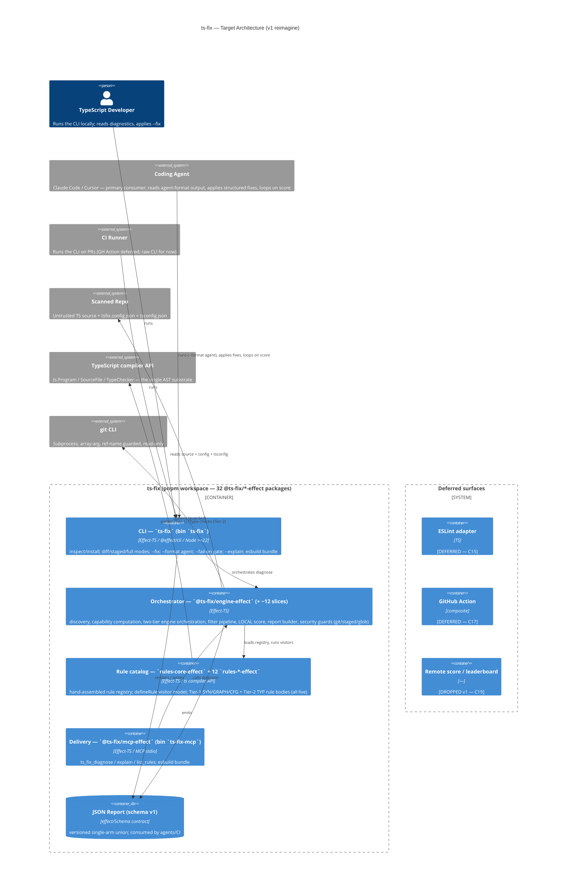

# Reimagined Architecture — `ts-fix`

*Phase C of `/modernize-reimagine`. Target design for the TypeScript-equivalent of react-doctor. Generated 2026-05-24. Reviewed by `architecture-critic` (§9).*

> **Implementation note (added after the rewrite).** This document records the **target design**. The shipped implementation is an **Effect-TS v3.21 strangler-fig rewrite** across **32 workspace packages** (`@ts-fix/<dir>-effect`, each with `src/main` + `src/test`) — see root `CLAUDE.md` §2 for the real package table. The **conceptual** design here is current (the two-tier engine §4, scoring §5, the security guards, the BC contract). Two concrete decisions were **reversed** in the rewrite, and are flagged inline below: (1) §1.5/§6 "drop Effect" — Effect was *adopted*: `Effect`/`Scope`/`Schema` carry the resource lifecycles, error channel, and wire contracts the design assigned to hand-rolled `using`/`Result`/validators; (2) §3 "three packages" + §6 "tsup" — the implementation is 32 packages built with **esbuild** (`build.mjs`) for the CLI/MCP bundles. Package names like `@ts-fix/core` / `ts-fix-rules` below map to the real tree (`@ts-fix/engine-effect` + the `rules-*-effect` slices, etc.).*

Inputs: `AI_NATIVE_SPEC.md` (capabilities C1–C20, behavior contract BC-01…BC-24, Phase-B decisions §6). Scope reflects the recorded decisions: **P0 = C1–C10, C13, C14, C16**; remote score **dropped**; ESLint adapter + GitHub Action **deferred**; scoring model kept, weights re-tuned for TS. *(The Phase-B "Tier-2 = seam + stub" decision was superseded: all four tiers, including the 18 type-aware TYP rules, are now live.)*

---

## 1. Design principles (what makes this a reimagine)

1. **One AST substrate, two tiers — one parse, one type-check.** Use the **in-process TypeScript compiler API** (`typescript`) as the single analysis substrate — not oxlint, and **not** a `tsgo`/`tsgolint` subprocess (that option is removed from the v1 contract; revisit only as a future fast-path). The substrate is built **once per project**: `ts.createProgram` over the resolved tsconfig file set. The result of `program.getPreEmitDiagnostics()` (semantic + syntactic) **is** the `typecheck:ok` signal — there is no separate probe build. On the healthy path the Program's already-parsed `SourceFile`s serve **both** tiers (one parse): Tier-1 (SYN/GRAPH/CFG) walks them without the checker; Tier-2 (TYP) walks the same ASTs with `program.getTypeChecker()`. Only on the **broken-project path** (Program won't build / type-check fails) does Tier-1 fall back to standalone per-file `ts.createSourceFile` parses — resilient, always available, and the *only* place a second parse strategy exists. This dissolves react-doctor's type-unaware limitation at the substrate level without ever type-checking or parsing twice on the common path. *(Incorporates critic B1, M2.)*
2. **Local, deterministic, offline.** No network in the hot path. The score is computed in-process from the diagnostic set. Same inputs → identical diagnostics, identity strings, and score. This is the property an agent loop (`while score < target: fix && rescan`) depends on.
3. **Agent-first output.** Structured machine-applicable fixes and rule-deduplicated, fix-sorted output are P0, not an afterthought. The deterministic diagnostic identity is the stable contract an agent references across runs.
4. **Carry the proven mechanism, rebuild the domain.** The registry codegen, capability-gated activation predicate, filter pipeline, diagnostic identity, scoring math, versioned report, and every security guard transfer from react-doctor (verified domain-agnostic). Only detection logic + the token vocabulary + project discovery are rewritten.
5. **Resource-lifecycle discipline.** *(Design intent below; the implementation reversed the Effect choice — see the implementation note at the top.)* The original design dropped Effect (react-doctor's beta-pinned debt #4) in favor of plain TypeScript with tagged-error classes and a small `Result` type + explicit dependency injection, hand-managing three resource lifecycles via a `using`/`Symbol.dispose` convention. **The shipped rewrite instead adopted Effect-TS v3** (a stable release, not the legacy beta): the `ts.Program` lifecycle goes through an Effect `Scope` (`scale.scopedProgram`, `Effect.acquireRelease` — RULE-036), errors flow on the Effect error channel (`effect/Data` `TaggedError`), wire contracts are `effect/Schema`, and DI uses `@effect/platform` `FileSystem`/`Path` service Layers (no bespoke `Context.Service`). The resources still needing disposal are the same: the `ts.Program` (pins memory until dropped — critical on the monorepo loop, §4.3), temp files (atomic-private-write, BC carried), and git subprocesses (kill-on-timeout). *(Incorporates critic m1; Effect-drop decision reversed in the rewrite.)*
6. **No custom plugin loading in v1 — BC-18 satisfied by construction.** react-doctor's #1 security finding is the CWE-94 RCE from auto-`require`-ing plugins declared in a *scanned* repo's config. There is nothing to "carry" here — the legacy behavior *is* the vulnerability. v1 ships a **first-party catalog only**: `tsfix.config.json#plugins` is **ignored** (warned, never executed). This removes the entire RCE class by construction. If third-party plugins are ever wanted, they must be bare npm names resolved from the *tool's own* `node_modules` behind an explicit `--allow-plugins` flag — never from the scanned repo. *(Incorporates critic B2.)*

---

## 2. C4 Container diagram



---

## 3. Service boundaries & rationale

> **Implementation note.** The design below described **three packages** (engine / core / CLI) plus a deferred API. The rewrite decomposed these into **32 fine-grained `@ts-fix/<dir>-effect` slices** (strangler-fig granularity, one slice per concern) — the engine/core/CLI *responsibilities* below are intact, just spread across many packages. The mapping: **Rule Engine** → `rules-core-effect` (substrate) + 12 `rules-*-effect` category slices + `rules-registry-effect`; **Diagnostic Core** → `engine-effect` (orchestrator) over `discovery`/`capabilities`/`config`/`engine-plan`/`module-graph`/`filter-pipeline`/`score`/`build-report`/`scale`/`security`/`contracts`/`errors`; **CLI** → `cli-effect`; the deferred **API** shipped as the **MCP server** `mcp-effect` instead (the stronger AI-native surface, §8). See root `CLAUDE.md` §2 for the full table.

### 3.1 `ts-fix-rules` (Rule Engine) → `rules-core-effect` + `rules-*-effect`
**Owns:** the rule catalog and the activation substrate. Houses: `defineRule`/`defineGraphRule` visitor model + `runRule`/`runTypeAwareRule`/`runGraphRule` runners + diagnostic identity (`rules-core-effect`); a **hand-assembled rule registry** (`rules-registry-effect` — the codegen `gen:check` of the original C20 design was replaced by a typed aggregator); all Tier-1 **SYN** rule bodies (Type Assertions, Naming, syntactic Security, …); **GRAPH** rule bodies (cycles, unused exports — over the module graph the engine provides); **CFG** rule bodies (strictness-gap rules reading tsconfig, in `rules-core/src/main/rules/strictness/`); and the Tier-2 **TYP** rules — **all 18 are live** (the original design's "stubbed `create()` bodies" seam was filled): they read `ctx.checker` under `typecheck:ok` and emit nothing on the Tier-1 / broken-project path. One package per category (`rules-async`, `rules-type-safety`, …), one file per rule.
**Entities:** `Rule`, `Category`, `Capability`/`RuleMeta`, the capability-gating predicate (pure, over a token `Set<string>` — in `capabilities-effect`).
**Why separate:** the catalog evolves fastest and must be independently testable; the strangler-fig rewrite gave each category its own package so it could be transformed + equivalence-tested in isolation.
**Depends on:** `typescript` (AST types) + `contracts-effect` (Diagnostic/RuleMeta); `rules-*` depend on `rules-core-effect`.

### 3.2 `@ts-fix/core` (Diagnostic Core) → `engine-effect` + slices
**Owns:** everything between "a directory" and "a report." Project discovery (`discovery-effect` — tsconfig resolution through `extends`, project-kind classification, TS version, module system, build-tool detection — C1); capability computation incl. the `typecheck:ok` probe (`capabilities-effect` + `discovery-effect`, C2, BC-07); the **two-tier engine orchestrator** (`engine-effect`/`engine-plan-effect` — Tier-1 always; Tier-2 only under `typecheck:ok`, building one shared `ts.Program` and reusing the checker across TYP rules — C4); the **module graph** builder (`module-graph-effect`, feeds GRAPH rules); the **filter pipeline** (`filter-pipeline-effect` — auto-suppress → severity → ignore → inline-disable — C6, BC-11); **local scoring** (`score-effect`, C7, BC-01/02/03); the **report builder** (`build-report-effect`, C9, BC-23, monorepo worst-project min BC-05); the **scale guard** (`scale-effect`, BC-24); and the **security guards** (`security-effect` — `GitRevision` with `isSafeGitRevision` BC-15; `StagedFiles` with Zip-Slip defense BC-16; `Glob` ReDoS caps BC-17; `Env` sanitization BC-19; `Plugins` trust boundary BC-18). The `Diagnostic`/`Fix`/`RuleMeta`/`Config` types live in `contracts-effect`; `ProjectInfo` in `discovery-effect`; tagged errors in `errors-effect`.
**Why separate:** the orchestration + guards are the stable, security-critical heart and must not depend on CLI concerns; the rewrite split them into one slice per concern for isolated transformation + equivalence testing.
**Module graph:** GRAPH rules consume a `ModuleGraph` built by `module-graph-effect` (relative-specifier resolution against the in-project file set) §4.1.
**Public boundary:** `engine-effect` exports the `DiagnoseResult` shape from `AI_NATIVE_SPEC.md §3.2`; consumers (`cli-effect`, `mcp-effect`) call `diagnose`/`diagnoseNode` directly.
**Depends on:** the rule slices, `typescript`, `git` (subprocess via `security-effect`), `@effect/platform` FileSystem/Path.

### 3.3 `ts-fix` (CLI) → `cli-effect`
**Owns:** the published binary (C10). Commands `inspect` (default) + `install`; flags/modes (diff/staged/full, `--json`/`--json-compact`, `--score`, `--deep`/`--no-deep`, `--fail-on`, `--annotations`, `--pr-comment`, `--explain`/`--why`, `--respect-inline-disables`); the **`--fix` applier** (C13 — applies `Fix.edits` as non-overlapping descending char-offset splices; on overlap, apply first + drop conflicts this pass, converge in ≤2 passes); the **agent output formatter** (C14 — `--format agent`: rule-deduplicated, tier+fixKind sorted, category-grouped, path-stripped); exit-code gate (BC-21); renderers; `install` (skill C18 + git hooks). **`--explain`/`--why` is fully offline/deterministic** — it renders the static `rule.recommendation` / `help` / (for TYP) `inferredType` from rule metadata; **no model call in v1** (the "AI-native" value is structured metadata an agent consumes, not an in-tool LLM round-trip). *(critic m2, m3.)*
**Why separate:** consumer of core; the place all human/agent-facing presentation lives. Built with **esbuild** (`build.mjs`) into a self-contained `dist/cli.js` (`typescript` external). The flag surface is re-imagined on `@effect/cli` (POSIX parsing, auto-help, RULE-028 flag-exclusivity as `Options` constraints) — behaviorally equivalent (same flags, validations, output, exit codes), not a byte-verbatim port of the hand-rolled argv parser. Formatters live in `format-effect`.
**Depends on:** `engine-effect`, `format-effect`, `fix-applier-effect`, `build-report-effect`, `exit-code-effect`, `rules-registry-effect` (for `--explain` rule metadata).

### 3.4 Programmatic API + delivery → `mcp-effect`
The deferred thin `diagnose(dir, opts) → DiagnoseResult` API (C12) shipped instead as the **MCP server** `mcp-effect` (bin `ts-fix-mcp`) — the stronger AI-native surface flagged in §8. It exposes `ts_fix_diagnose` / `ts_fix_explain` / `ts_fix_list_rules` over stdio; pure handlers in `tools.ts`, SDK wiring in `server.ts` with `effect/Schema` arg validation (zod gone — RULE-029). Built with esbuild → `dist/server.js`. Callers who want the in-process API import `diagnose`/`diagnoseNode` from `@ts-fix/engine-effect` directly.

---

## 4. The two-tier engine (the central design)

### 4.1 Single Program build — the type-check IS the capability probe

The critic's B1 was decisive: a separate `typecheck:ok` probe would type-check the project, then Tier-2 would type-check it *again*, and Tier-1's standalone parse would re-parse every file a *third* time. The corrected design builds the substrate exactly once and derives everything from it.

```
   directory ──► discover-ts-project ──► ProjectInfo ──► capabilities (Set<string>, sans typecheck:ok yet)
                         │
                         ▼
              activate(rules, caps)            (decides which SYN/GRAPH/CFG/TYP rules are in scope)
                         │
                         ▼
        ┌──── try: ts.createProgram(tsconfig fileset)  [ONE build] ────┐
        │                                                              │
   build fails / OOM                                          program.getPreEmitDiagnostics()
        │                                                         (semantic+syntactic)
        ▼                                                              │
  BROKEN-PROJECT PATH                                       ┌──────────┴──────────┐
  per-file ts.createSourceFile                          clean?                 not clean?
  → Tier-1 only (SYN/CFG; GRAPH                            │ YES                  │ NO
    via resolveModuleName)                          typecheck:ok ✔         typecheck:ok ✗
  Tier-2 SKIPPED, scorePartial=true                        │                     │
        │                                    ┌─────────────┴───────┐   (optionally surface
        │                                    ▼                     ▼    tsc errors as diags)
        │                          TIER-1 over Program's    TIER-2 over same
        │                          parsed SourceFiles       Program + getTypeChecker()
        │                          (no checker)             reuse checker across TYP rules
        │                                    │                     │   Tier-2 SKIPPED if not clean,
        │                                    └──────────┬──────────┘   scorePartial=true
        └──────────────────────────────────────────────┤
                                                        ▼
                              Diagnostic[] (each tagged tier)
                                          │
                              filter pipeline (4 ordered stages, BC-11)
                                          │
                              local score + report + fixes
```

- **One parse, one type-check on the healthy path.** When the Program builds, `program.getSourceFile()` gives Tier-1 its ASTs for free — Tier-1 and Tier-2 walk the *same* parsed sources. The standalone `ts.createSourceFile` parse exists **only** on the broken-project path. *(critic B1, M2)*
- **`typecheck:ok` is a result, not a pre-step.** `getPreEmitDiagnostics()` filtered to semantic/syntactic errors *is* the signal. No second build.
- **GRAPH correctness.** Module-graph rules (cycles, unused exports) use **`ts.resolveModuleName`** with the parsed `CompilerOptions` (honoring `paths`/`baseUrl`/`exports`/`extends`), not raw import-string scraping. **`no-unused-exports` is reclassified to the `typecheck:ok` path** — it cannot be computed correctly without resolving every importer. *(critic M2)*
- **Honesty (BC-03).** Tier-2 skipped (broken project OR `--no-deep`) → every TYP rule records a `skippedCheckReason`, `scorePartial=true`, score labeled a *different scale* (see §5). `--deep`/`--no-deep` force/skip Tier-2.

### 4.2 Scale model — re-derived for the in-process substrate

The legacy batch + binary-split (BC-24) recovered from an **oxlint subprocess**'s argv-length cap and per-spawn OOM. With an in-process Program there is no argv cap, and you don't feed files in batches — so binary-splitting the input list is a **no-op against the real failure mode**, which is now **Program memory**. *(critic M3)*

The real levers for v1:
- **Per-project Program, built and disposed sequentially** (§4.3) — never hold N Programs resident.
- **Builder/incremental program reuse** within a watch/loop session where available.
- **Diff/staged mode:** still build the Program (cross-file type info requires it) but **report only on the include set** — bounds output, not the type-check.
- **Memory ceiling → graceful degrade:** if the Program won't fit, skip Tier-2 with `scorePartial=true` rather than crash.
- BC-24's binary-split is retained **only** if a `tsgolint` subprocess path is ever reintroduced (§8); it is not part of the in-process v1.

### 4.3 Monorepo model

C1 resolves `tsconfig.json` through `extends` and classifies `monorepo`. A monorepo has many tsconfigs. v1 treats **each workspace tsconfig independently** (simpler than solution-style `ts.createSolutionBuilder`; revisit if project-references demand it): for each workspace, build → analyze → **dispose** its Program before the next, accumulating diagnostics. Never N Programs resident at once (this is also the memory fix for §4.2). **BC-05 summary score = `min` over per-project scores**; a project whose Program failed contributes a partial score, and **the summary `scorePartial` is true if *any* project is partial.** *(critic M4)*

---

## 5. Scoring — model kept, weights frozen (critic M1 reversal)

The Phase-B decision was "keep the model, re-tune weights for TS." The critic (M1) showed a tier-weighted, config-tunable matrix actively breaks the property the score exists for, so the **incorporated** v1 design is more conservative:

- **Two frozen weights, not five.** Penalty per distinct fired rule: **error = 1.5, warning = 0.75** — react-doctor's proven pair. The *catalog's own tier mix* does the de-facto weighting (TYP rules skew toward `error`, CFG toward light `warning`), so a five-bucket matrix is unnecessary and uncalibratable without a corpus. Tier-weighting is revisited post-v1 *with* a corpus.
- **Weights are frozen constants in code, versioned with the schema — NOT user config.** Config-tunable weights would make two machines compute different scores for identical code, destroying the cross-machine comparability the score is *for*. (The legacy debt being fixed — #7 hardcoded *endpoint* — is about network endpoints, not scoring constants; do not over-correct onto the weights.)
- **Two scales, one honesty mechanism.** Crossing the `typecheck:ok` boundary changes which rules are *in scope* (TYP rules appear), so a full score and a partial score are **different scales** — fixing an unrelated type error can legitimately bring TYP rules into scope and move the score. This is the *same* hazard BC-03 already flags: `scorePartial=true` means "different scale, not comparable to a full score." An agent loop must compare only same-scale scores.

```
score = max(0, round(100 − (distinctErrorRules × 1.5 + distinctWarningRules × 0.75)))
empty diagnostics → 100 ; bands: ≥75 "Great" / ≥50 "Needs work" / else "Critical"
```

**Determinism preserved** (no network, no clock, no config-dependent weights). *(Incorporates critic M1.)*

---

## 6. Technology choices

| Choice | Decision | One-line justification |
|---|---|---|
| Language / runtime | strict ESM TypeScript, Node ≥22 | carry the proven legacy baseline |
| AST substrate | **in-process `typescript` compiler API** (no subprocess) | one substrate, one parse, one type-check for both tiers; removes oxlint's type-unaware ceiling (§1.1, §4.1) |
| Core composition | **Effect-TS v3.21** — `Effect` + `Scope` + `effect/Schema` + `effect/Data` tagged errors + `@effect/platform` service Layers *(design originally said "plain TS, no Effect"; reversed in the rewrite — §1.5)* | a stable Effect release (not the legacy beta) carries the Program/temp-file/subprocess lifecycles via `Scope`, the error channel, and the wire contracts; DI is platform Layers, no bespoke `Context.Service` |
| Monorepo | **pnpm workspace** (32 packages, `packages/*`) | proven, low-risk; root scripts are `pnpm -r run typecheck` / `pnpm -r run test` |
| Build | **esbuild** (`build.mjs`) for the CLI + MCP runnable bundles; libs resolve from `src/main` *(design originally said "tsup")* | self-contained ESM binary, `typescript` external |
| Tests | **`@effect/vitest` + `vitest`** | fast, ESM-native; no mocks (in-memory `FileSystem.layerNoop` stubs); 14 `*equivalence.test.ts` oracles pin legacy behaviour |
| Rule registry | **hand-assembled aggregator** (`rules-registry-effect`) *(design originally said codegen `gen:check`)* | a typed `registry.ts` importing each `rules-*` slice |
| Fix application | **structured text edits** (`range = [startOffset, endOffset)` char offsets + `replacement`; apply non-overlapping descending, drop conflicts this pass, converge in ≤2 passes) | language-neutral, agent-applicable; the file-writing shell is an Effect over FileSystem (atomic temp-then-rename, CWE-59 reject) §3.3 |
| Agent surface | **`--format agent` + MCP server** (`mcp-effect`) | meets C14; the MCP server (the original §8 fast-follow) shipped |
| Validation | **`effect/Schema`** for report + config + MCP tool args | the versioned single-arm union (BC-23) is a Schema; zod removed (RULE-029) |

---

## 7. Data migration

ts-fix is **greenfield adoption, not a data migration** — react-doctor has no databases. The only "stores" and their treatment:

| Legacy store | Treatment |
|---|---|
| `react-doctor.config.json` / `package.json#reactDoctor` | New format `tsfix.config.json` / `package.json#tsFix`; **no migration** (different tool, different rules). Same lenient-validation contract (BC-22). |
| JSON report (`schemaVersion:1`) | Fresh `schemaVersion:1` for ts-fix; consumers re-integrate. Same forward-compat single-arm-union design. |
| Diagnostic identity / baselines / suppress files | Identity **scheme** kept (`filePath::line:column::plugin/rule`) so the baseline mechanism is portable; concrete ids differ (TS rules), so existing react-doctor baselines do not carry — expected for a different tool. **Note:** identity is stable across *non-mutating* re-scans; `--fix` shifts line:column and **invalidates positional identities by design** — an agent must not assume cross-fix identity stability (critic m4). |
| Remote score / leaderboard DB | **Dropped (C19).** No migration. |

No schema-conversion, backfill, or dual-write phase is required.

---

## 8. Forward path

*The two top items below were called out here as future work and have since **shipped** in the Effect-TS rewrite; the rest remain forward-looking.*

- ✅ **MCP server** as a first-class agent surface — shipped as `mcp-effect` (bin `ts-fix-mcp`): `ts_fix_diagnose` / `ts_fix_explain` / `ts_fix_list_rules` over stdio (an `apply_fix` tool wrapping `--fix` is a natural addition).
- ✅ **Tier-2 real implementation** — the `ts.Program` + checker are wired; all 18 TYP rules are live (read `ctx.checker` under `typecheck:ok`).
- **ESLint adapter (C15)**, **GitHub Action (C17)** — deferred surfaces.
- **`Schema.TaggedError` migration** — complete the signature-preserving move of the `errors`/`security` tagged errors from `effect/Data` `TaggedError` to `Schema.TaggedError` where compatible.
- **Rust/oxlint Tier-1 fast-path** if parse latency demands it.
- **Optional remote telemetry** (C19) — only if a leaderboard is wanted, behind the proven request caps (BC-20).

---

## 9. Architecture-critic review & incorporated changes

An adversarial `architecture-critic` pass reviewed this design against the spec. Two blockers, four majors, six minors. **All were incorporated** (the design above is the post-review version):

| Finding | Severity | Incorporated as |
|---|---|---|
| **B1** — `typecheck:ok` probe type-checks + parses twice on the healthy path | blocker | §1.1, §4.1 — single Program build; `getPreEmitDiagnostics()` *is* the signal; one parse serves both tiers; standalone parse only on broken-project path |
| **B2** — BC-18 plugin trust boundary named but never designed (the #1 RCE) | blocker | §1.6 — **no custom plugin loading in v1**; scanned-repo `plugins` ignored; RCE class removed by construction |
| **M1** — tier-weighted config scoring breaks cross-machine comparability | major | §5 — collapsed to two **frozen** weights (1.5/0.75) in code, not config; tier mix does de-facto weighting; scale-change honesty unified with BC-03 |
| **M2** — per-file parse not cheaper on healthy path; GRAPH overclaimed | major | §4.1 — Program's parsed sources serve Tier-1 on healthy path; GRAPH uses `ts.resolveModuleName`; `no-unused-exports` → `typecheck:ok` path |
| **M3** — legacy batch/binary-split is a no-op vs in-process Program | major | §4.2 — re-derived scale model (per-project Program, sequential dispose, diff-bounded reporting, memory-ceiling graceful degrade); BC-24 retained only for a future subprocess path |
| **M4** — monorepo one-Program model under-specified | major | §4.3 — per-workspace tsconfig, sequential build→analyze→dispose, never N resident; BC-05 `min`; summary `scorePartial` if any project partial |
| **m1** — Effect drop moves resource-lifecycle work onto us | minor | §1.5 — *resolved differently in the rewrite:* Effect-TS was adopted (stable v3.21), so its `Scope` carries the Program/temp-file/subprocess lifecycles directly (the "drop Effect" decision was reversed) |
| **m2** — fix offsets/overlap undefined | minor | §3.3, §6 — `range = [startOffset,endOffset)` char offsets; non-overlapping descending, drop conflicts, ≤2-pass convergence |
| **m3** — `--explain` "natural-language" risked an LLM call | minor | §3.3 — renders static metadata only; offline/deterministic; no model call in v1 |
| **m4** — identity oversold as cross-run stable | minor | §7 — note: stable across non-mutating rescans; `--fix` invalidates positional identity by design |
| **m5** — `@ts-fix/api` surface designed twice | minor | §3.2/§3.4 — `engine-effect` exports the `DiagnoseResult`; the API shipped as the MCP server (`mcp-effect`) rather than a separate re-export package |
| **m6** — §9 empty but header claimed review | minor | this table |

**Affirmed by the critic as correct — frozen, not to be re-litigated:** the two-tier engine concept; local/deterministic/offline scoring + dropping C19; partial-score honesty as a first-class fail-safe; carrying the domain-agnostic security guards verbatim (BC-15/16/17/19); the filter-pipeline order + identity scheme (BC-11/13); the engine/core/CLI decomposition (the rewrite refined this into 32 fine-grained slices, §3) with no website; text-edit fixes over ts-morph for v1. *(Two design choices the critic affirmed were later revised by the rewrite: the codegen registry became a hand-assembled aggregator, and the MCP server — flagged as a fast-follow — shipped.)*
